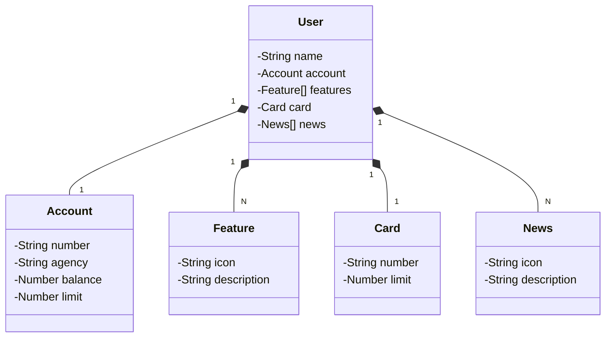

# Santander Dev Week 2023
Java RESTful API criada para a Santander Dev Week 2023.

## Principais tecnologias
As principais tecnologias utilizadas na criação desta API foram: Java 17, Spring Boot 3, Spring Data JPA (para cuidar da integração com o banco de dados), Swagger (para documentar a API) e Railway (para deploy do banco e da API)

## Diagrama de classes
O diagrama de classes a seguir está na sintaxe Mermaid.

